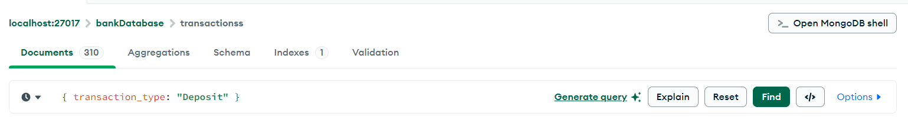
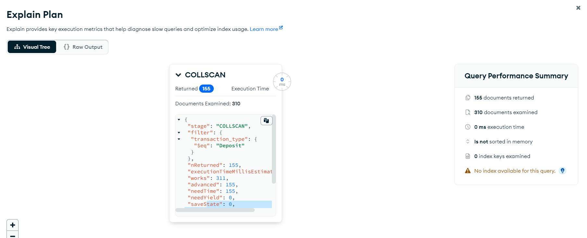
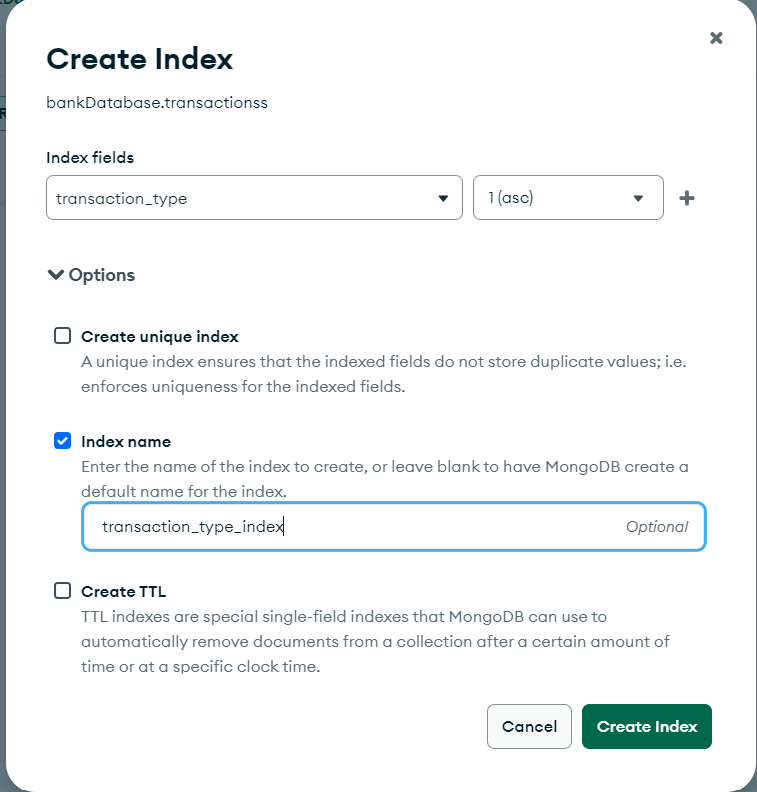
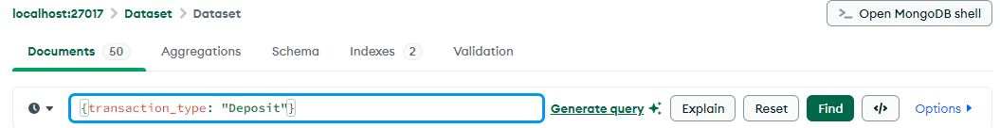
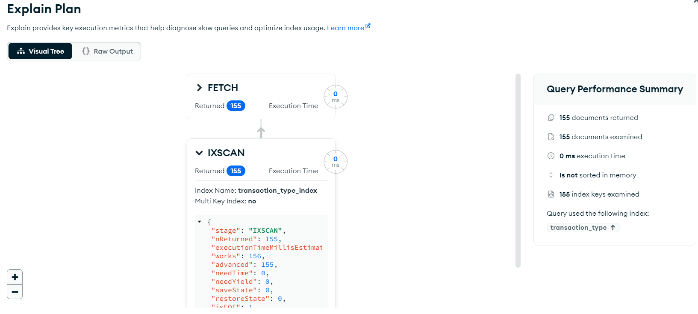

# **MongoDB Indexing**


## **Table of Contents**

- [Before Indexing in MongoDB](#Before-Indexing-in-MongoDB)

- [AfterIndexing in MongoDB](#before-indexing-in-mongodb)

- [Key Differences Between COLLSCAN and IXSCAN](#key-differences-between-collscan-and-ixscan)

- [Types of SCAN](#types-of-Scan)

---

## **Before Indexing in MongoDB**

Before indexing in MongoDB, queries were processed by performing a **collection scan**, where every document in the collection was checked sequentially. This approach was inefficient for large datasets, leading to high query latency and increased resource usage. Sorting results also required scanning and sorting the entire dataset in memory, which could slow down performance.


1. **Full Collection Scan**: MongoDB searches through all documents in a collection to find those that match the query criteria. This is inefficient for large collections as it involves examining every document sequentially.

2. **High Latency**: Without an index, queries take longer to execute because MongoDB has to process the entire dataset. The larger the collection, the more time it takes to return results.

3. **Increased Resource Usage**: A collection scan consumes more CPU and memory resources since MongoDB needs to parse through a significant number of documents.

4. **Scalability Issues**: As the dataset grows, the time taken to execute queries increases exponentially, impacting the application's performance and scalability.

5. **Unoptimized Sorting**: If a query requires sorting, MongoDB must sort the entire result set in memory, which can lead to slow performance or even query failure if the result set exceeds the available memory.


### **Example:**

### **Step-by-Step Guide (Without Indexing):**

1. **Open MongoDB Compass** and navigate to the `transactions` collection.  

2. Go to the `Documents` tab and run the following query in the filter section:  

  - **Query:**

   ```javascript
   { transaction_type: "Deposit" }
   ```



3. Click on the **Explain Plan** tab and analyze the output.  

#### **Explain Plan:**  

- The explain plan will show a **COLLSCAN** (collection scan), meaning MongoDB is scanning all documents in the `transactions` collection to find those matching `transaction_type: "Deposit"`.  
- This will result in high resource usage, especially for large datasets, and the number of documents scanned will equal the total number of documents in the collection.  

- The explain plan includes a **Query Performance Summary** with information on the execution of your query such as:

  - Execution time

  - The number of returned documents

  - The number of examined documents

  - The number of examined index keys

*Note:*

- By default, the explain stages are are shown as a Visual Tree. Each query operation appears as a node on the tree.
- You can also view the explain details in raw JSON format by selecting the Raw Output view.





#### **Output of MongoDB's `explain` command**


1. **`stage`**:  
   - The stage of the query execution.  
   - `"COLLSCAN"` indicates that the query used a collection scan, meaning MongoDB scanned all documents in the collection to find matching ones.

2. **`filter`**:  
   - Represents the query filter used to narrow down the results.  
   - In this case, it filters for documents where the `transaction_type` is equal to `"Deposit"` (`"$eq": "Deposit"`).

3. **`nReturned`**:  
   - The number of documents returned by the query.  
   - Here, `155` documents matched the filter and were returned to the client.

4. **`executionTimeMillisEstimate`**:  
   - An estimated time, in milliseconds, taken by the query to execute.  
   - It is `0` here, possibly because the query executed too quickly to measure or because this is an approximate value.

5. **`works`**:  
   - The number of operations performed by the query execution engine, such as fetching or evaluating documents.  
   - This query required `311` operations.

6. **`advanced`**:  
   - The number of times a document was successfully passed to the next stage of the query.  
   - `155` documents were processed and passed on, matching the `nReturned` count.

7. **`needTime`**:  
   - The number of times the query execution paused to fetch or process data.  
   - `155` indicates there were pauses while scanning the collection.

8. **`needYield`**:  
   - The number of times the query execution paused to allow other operations to proceed.
   - `0` indicates the query did not yield.

9. **`saveState`**:  
   - The number of times the query state was saved, which usually happens when yielding.  
   - `0` here means the query state was never saved, consistent with `needYield: 0`.

10. **`restoreState`**:  
    - The number of times the query state was restored after being saved.  
    - `0` indicates no state restoration occurred.

11. **`isEOF`**:  
    - Indicates whether the query has reached the end of the collection.  
    - A value of `1` means the query finished scanning the collection.

12. **`direction`**:  
    - Specifies the direction in which the collection was scanned.  
    - `"forward"` means the collection was scanned in ascending order of the `_id` .

13. **`docsExamined`**:  
    - The total number of documents that were scanned during the query execution.  
    - `310` documents were examined to find the `155` that matched the filter.


---

## **After Indexing in MongoDB**

### **Understanding Indexes in MongoDB**

Indexes in MongoDB are crucial for improving query performance. Without indexes, MongoDB performs a collection scan, i.e., it scans every document in a collection to select those that match the query. Indexes support efficient query execution by allowing MongoDB to quickly locate the data that matches a query. This reduces query latency, optimizes resource usage, and improves the scalability of the application.

### **Advantages of Indexing**

1. **Optimized Query Execution**: With an index, MongoDB can directly look up matching documents, avoiding a full collection scan.
2. **Reduced Latency**: Queries execute faster since MongoDB leverages the indexed fields to narrow down the search space.
3. **Lower Resource Usage**: Indexing minimizes CPU and memory usage by avoiding unnecessary processing of unrelated documents.
4. **Improved Scalability**: As collections grow, indexed queries maintain consistent performance without exponential increases in execution time.
5. **Efficient Sorting**: MongoDB can use an index to return sorted results without requiring additional in-memory operations.


### **Example: Creating a Single-Field Index on `transaction_type`**

Let's say you want to optimize a query that searches for all documents where `transaction_type` is "Deposit".

### **Step-by-Step Guide:**

1. **Open MongoDB Compass** and navigate to the `transactions` collection.
2. Click on the `Indexes` tab.
3. Click on the `Create Index` button.
4. In the **Field** drop-down, select `account_type`.
5. Choose `Ascending` (1) for the index type.
6. Name your index (e.g., `transaction_type_index`).
7. Click `Create Index`.


- **Query:**

```javascript
{ transaction_type: "Deposit" }
```


#### **Explain Plan:**

- The explain plan will now show an **IXSCAN** (index scan) instead of a **COLLSCAN**.  
- MongoDB uses the index on `transaction_type` to directly locate the matching documents.  
- The number of documents examined will be much smaller, corresponding to only the matching documents.





*Note:*

- `FETCH` for retrieving documents

- `IXSCAN` for scanning index keys


#### **Output of MongoDB's `explain` command**

- **General Execution Information**

1. **`stage`:**  
   Indicates the type of operation performed at this stage.  
   - Here, `IXSCAN` refers to an **Index Scan**, meaning the query uses an index to fetch the data.

2. **`nReturned`:**  
   The number of documents returned by this stage of the query execution.  
   - Value: `155` (The query returned 155 documents).

3. **`executionTimeMillisEstimate`:**  
   The estimated time (in milliseconds) taken by the query to execute.  
   - Value: `0` (This indicates the query executed very quickly or the estimation rounds down).

4. **`works`:**  
   The number of times the operation was executed (e.g., the number of index entries checked).  
   - Value: `156`.

5. **`advanced`:**  
   The number of documents successfully passed to the next stage or returned to the user.  
   - Value: `155`.

6. **`needTime`:**  
   The number of times the operation was called but didn't return a document (e.g., it took time for other processing).  
   - Value: `0`.

7. **`needYield`:**  
   The number of times the operation yielded to allow another operation to run (e.g., yielding to other processes).  
   - Value: `0`.

8. **`saveState`:**  
   The number of times the state of the operation was saved (e.g., for yielding).  
   - Value: `0`.

9. **`restoreState`:**  
   The number of times the state of the operation was restored after yielding.  
   - Value: `0`.

10. **`isEOF`:**  
   Indicates whether the operation has completed processing all documents in its scope.  
   - Value: `1` (`true`), meaning the operation has reached the end.


- **Index Information**

11. **`keyPattern`:**  
   The pattern of the index used for this query.  
   - Value: `{ "transaction_type": 1 }` (The index is sorted in ascending order on the `transaction_type` field).

12. **`indexName`:**  
   The name of the index used.  
   - Value: `"transaction_type_index"`.

13. **`isMultiKey`:**  
   Indicates whether the index is a multikey index (used when a field contains arrays).  
   - Value: `false`.

14. **`multiKeyPaths`:**  
   Lists which fields in the index are multikey (if any).  
   - Value: `{ "transaction_type": [] }` (No multikey paths).

15. **`isUnique`:**  
   Indicates whether the index enforces uniqueness.  
   - Value: `false`.

16. **`isSparse`:**  
   Indicates whether the index is sparse (doesn't include documents with missing indexed fields).  
   - Value: `false`.

17. **`isPartial`:**  
   Indicates whether the index is partial (includes only documents meeting a specific filter criteria).  
   - Value: `false`.

18. **`indexVersion`:**  
   The version of the index used.  
   - Value: `2` (The latest index version).

19. **`direction`:**  
   Indicates the direction of the scan on the index.  
   - Value: `"forward"` (The index was scanned in ascending order).

20. **`indexBounds`:**  
   Describes the range of values scanned in the index for the query.  
   - Value: `{ "transaction_type": [["Deposit", "Deposit"]] }` (Only documents with `transaction_type` equal to `"Deposit"` were scanned).


- **Document and Index Operations**

21. **`keysExamined`:**  
   The number of index keys scanned.  
   - Value: `155`.

22. **`seeks`:**  
   The number of times the index scan was initiated (e.g., due to range queries).  
   - Value: `1`.

23. **`dupsTested`:**  
   The number of duplicate documents encountered and tested for validity.  
   - Value: `0`.

24. **`dupsDropped`:**  
   The number of duplicate documents encountered and skipped.  
   - Value: `0`. 

---

### **Key Differences Between COLLSCAN and IXSCAN**

| **Attribute**          | **COLLSCAN**                     | **IXSCAN**                     |
|-------------------------|-----------------------------------|---------------------------------|
| **Stage**              | COLLSCAN                        | IXSCAN                         |
| **Query Efficiency**   | Low                             | High                           |
| **Execution Time**     | Higher                          | Lower                          |
| **Resources Used**     | High CPU and memory usage       | Lower resource consumption     |
| **Scalability**        | Decreases with larger datasets  | Consistent performance         |

---

### **Types of SCAN**

In MongoDB, the `explain` method provides details on how a query is executed. The **execution plan** includes details on the type of scans used to retrieve data. Here are the different types of scans you might encounter:


1. **COLLSCAN (Collection Scan)**

   - **Description**: Scans every document in a collection to find matching documents.
   - **When Used**: Occurs when no suitable index exists for the query.
   - **Performance**: Inefficient for large collections as it requires a full scan.
   - **Example**:
     ```javascript
     db.collection.explain().find({ field: "value" });
     ```
     - If `field` is not indexed, MongoDB will perform a collection scan.


2. **IXSCAN (Index Scan)**

   - **Description**: Scans an index to find documents that match the query criteria.
   - **When Used**: When a suitable index exists for the query.
   - **Performance**: Much faster than a collection scan for large datasets.
   - **Example**:
     ```javascript
     db.collection.createIndex({ field: 1 });
     db.collection.explain().find({ field: "value" });
     ```
   - MongoDB uses the index on `field` for the scan.


3. **FETCH**

   - **Description**: Retrieves the actual document from the collection after finding the matching index entries.
   - **When Used**: Used in conjunction with `IXSCAN` when fields not in the index need to be returned or filtered.
   - **Performance**: Adds overhead if many documents need to be fetched.
   - **Example**:
     ```javascript
     db.collection.createIndex({ field: 1 });
     db.collection.explain().find({ field: "value" }).projection({ anotherField: 1 });
     ```

4. **COUNT_SCAN**

   - **Description**: Optimized scan to count documents using the index without fetching the documents.
   - **When Used**: For counting documents that match query criteria.
   - **Performance**: Faster than a full collection scan if the count query can be satisfied by the index.
   - **Example**:
     ```javascript
     db.collection.createIndex({ field: 1 });
     db.collection.explain().count({ field: "value" });
     ```


5. **SHARD_MERGE**

   - **Description**: Combines results from multiple shards in a sharded cluster.
   - **When Used**: For queries across a sharded collection.
   - **Performance**: Depends on the efficiency of shard-level execution.
   - **Example**:
     - Used automatically in sharded cluster queries.


6. **SORT**

   - **Description**: Sorts the query results based on specified fields.
   - **When Used**: When query results need to be sorted and no suitable index exists.
   - **Performance**: Sorting in memory can be expensive, especially for large datasets.
   - **Example**:
     ```javascript
     db.collection.explain().find({}).sort({ field: 1 });
     ```


7. **TEXT**

   - **Description**: Executes a full-text search query using a text index.
   - **When Used**: For text search queries.
   - **Performance**: Efficient when a text index exists for the queried field.
   - **Example**:
     ```javascript
     db.collection.createIndex({ content: "text" });
     db.collection.explain().find({ $text: { $search: "example" } });
     ```


8. **GEONEAR (Geospatial Search)**

   - **Description**: Performs geospatial queries to find documents near a specific point.
   - **When Used**: For geospatial queries using 2D or 2D sphere indexes.
   - **Performance**: Efficient when geospatial indexes are used.
   - **Example**:
     ```javascript
     db.collection.createIndex({ location: "2dsphere" });
     db.collection.explain().find({
       location: {
         $near: {
           $geometry: { type: "Point", coordinates: [longitude, latitude] },
           $maxDistance: 1000
         }
       }
     });
     ```


---
